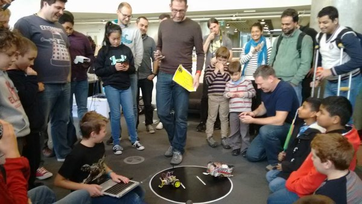

# NodeBots Day - Australia

This respository is for all NodeBots Day events being run in Australia and contains setup guides and information around simple bots and resources that can be used on the day.

## Things to do before the day

- **[Setup your machine](setup.md):** Bandwidth is shared during the event so please download and install all your software prerequisites beforehand so you can be up and running much faster. If you run into any problems, our friendly NodeBoteers will give you a hand on the day.

- **Buy Hardware Components (if you didn't purchase a kit):** If you're keen on building a simple robot you can take home with you then you'll need some components. [We've got a handy list here of what you need.](https://github.com/nodebotsau/simplebot#materials-needed)

- **Learn some basic electronics:** Check out our [handy guide](Nodebots%20electronics%20primer.pdf) if you want to learn (or freshen up) about electronics.

## Things to do on the day

- Bring your laptop.
- Bring any extra electronics components you want to use.
- [Join our slack channel](http://invite.nodebotsau.io/) if you havent already!

## What are you building?

Here are some useful resources depending on what you are building:

- SimpleBot: https://github.com/nodebotsau/simplebot
- Simplebot + SumoBot: https://github.com/nodebotsau/simplebot/blob/master/docs/sumobot.md
- Simplebot + LineFollower: https://github.com/nodebotsau/simplebot/blob/master/docs/linefollower.md
- Simplebot + Obstacle Avoidance: https://github.com/nodebotsau/simplebot/blob/master/docs/obstacleavoider.md
- Scientist Kit: https://github.com/nodebotsau/scientist-kit
- IoT Kit: https://github.com/nodebotsau/nodebots-iot-2017

## Sumobot Fight Rules

The sumobot fight takes place at the end of the day. The rules of the sumo-bot fight are taken from the main [nodebots.io](http://nodebots.io/sumo.html) site and are as follows:

### Dimensions

Sumo bots must fit into an 25cm cube. The "arena" will be a 90cm diameter circle on a flat surface.

### Competition rules

- Each match will consist of 3 rounds of 60 seconds each between 2 robots (1)
- Teams will compete in an initial round robin style event before selection of finalist who will go through elimination rounds.
- While damage/destruction is inevitable, it is not encouraged. Robots that purposely attempt to ruin their competition will be put in timeout with a professional finger-wagger for the remainder of the competition.

(1) Note that depending on number of teams and available time this may be shorted to one 90 second bout per match instead.

### Scoring

- If a robot leaves the competition arena, the opposing robot wins the round
- The first robot to win a majority of rounds wins the match.
- If neither robot wins the round, the match judge will choose the winner, based on something whimsical and/or random, probably style.

## Contacts and Contributors

Our thanks to the people below who have helped organize and run nodebots day in Australia:

- Andrew Fisher - Chief Nodeboteer & Cat Herder [@ajfisher](http://github.com/ajfisher)
- Andy Gelme [@geekscape](http://github.com/geekscape)
- Andrey Sidorov [@sidorares](http://github.com/sidorares)
- Dave Hall [@skwashd](http://github.com/skwashd)
- Glen Arrowsmith [@garrows](http://github.com/garrows)
- Anna Gerber [@annagerber](http://github.com/annagerber)
- Damon Oehlman [@damonoehlman](http://github.com/damonoehlman)
- Julian Pittas [@julianpitt](http://github.com/julianpitt)
- Steven de Salas [@sdesalas](http://github.com/sdesalas)
- Mark Woolfe [@wolfeidau](http://github.com/wolfeidau)

## Icon
NodeBots icon based on 'Robot' designed by Julien Deveaux from the Noun Project, used under the terms of the [Creative Commons – Attribution (CC BY 3.0)](http://creativecommons.org/licenses/by/3.0/us/) license
