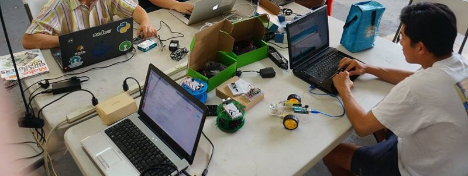

# Setting up your NodeBots Environment

If you have all of this installed before you arrive then you'll be ready to get
cracking and start playing with hardware.

If any of this isn't working, don't worry, our friendly team will be able to help
you on the day but it's important to have everything downloaded or you'll be
waiting a while to get it onto your machine.

### MacOS (OS X)

Installing using the Homebrew package manager is the recommended approach
as it makes getting packages up and running easy.

Open the Macintosh terminal (`Applications/Utilities/Terminal.app`) and type
the following commands

* To install [homebrew](http://brew.sh/)
```
/usr/bin/ruby -e "$(curl -fsSL https://raw.githubusercontent.com/Homebrew/install/master/install)"
```
* Now install Git (for version control) and node (to install and mange Node.js)
```
brew install git node
```
* Close the terminal application by typing `exit` and then reopen it again so that your changes
take affect

Now that you have your tool chain installed we can procced to the Nodebots Day specific setup

* Install the CH340 Drivers - this is in a folder called
[drivers](drivers/CH34x_Install_V1.3.pkg)

Now we need to install interchange, a package manage for nodebots. Open the
Macintosh terminal (`Applications/Utilities/Terminal.app`) and type
the following commands

* Install [Interchange](https://github.com/johnny-five-io/nodebots-interchange)
`npm install -g nodebots-interchange`

If this all installs without any errors then you're good to go.

#### Manual installs

If you don't want to install using Homebrew then follow the various instructions given
on these websites

* [Node Version Manager](https://github.com/creationix/nvm) then install the latest long term support version of Node.js with `nvm install --lts`
* [Git version control](https://git-scm.com/)
* [Arduino Mac Install guide](http://arduino.cc/en/Guide/MacOSX) NB This package is optional,
you can use it to write C code for your hardware.


### Linux

Linux is generally pretty straight forward. Install the following (assuming Ubuntu / Debian style machines):

* Install Git `apt-get install git`
* Install curl `apt-get install curl`
* Install nodejs using [NVM](https://github.com/creationix/nvm) - alternatively
[follow the appropriate directions here](http://nodejs.org). Don't use your
package manager as the version won't be up to date enough to work with hardware.
* Install [Interchange](https://github.com/johnny-five-io/nodebots-interchange)
`npm install -g nodebots-interchange`

Optionally:

* Arduino [Available here to install manually](http://playground.arduino.cc/Learning/Linux) or a simple 'apt-get install arduino' should do it for a relatively recent version.

Finally - attempt to install node-serialport as this will test everything is working:

```
	npm install serialport
```

### Windows

_Please note_

Windows users can have the most problems with getting up and running of anyone.
Please ensure you can install Johnny Five before coming to the event or you may
slow down on the day.

Install the following:

* Git: [Windows Installer for Git](https://git-scm.com/downloads)
* NodeJS: [Windows Installer here](http://nodejs.org/en/download/)
* Serial driver software: [In the drivers folder install the windows package](drivers/CH340%20windows.zip)
* Install [Interchange](https://github.com/johnny-five-io/nodebots-interchange)
`npm install -g nodebots-interchange`

```
    npm install johnny-five
```

This will shake out any problems you've got. Occasionally there is trouble with
Windows but they are fairly well documented and a quick google of the error
message will usually resolve it.

## Run a basic blink program

Next, if you have an arduino nano to hand, you might want to get it setup with firmata.

Make sure its connected to the PC by USB first, there should be a red LED lighting up when you do.

```
interchange install StandardFirmata -a nano
```

To test you've got Firmata running, you'll need a basic blink program. First install `simplebot` project.

```
git clone https://github.com/nodebotsau/simplebot.git
cd simplebot
npm install
```

Then run the blink program: 

```
node examples/blink.js
```

If it all goes well. You'll see a blinking LED positioned next to the L on your arduino.

```
[ ] RX
[ ] TX
[*] POW 
[*] L     <--- this light will start flashing
```


Open the [`examples/blink.js`](https://github.com/nodebotsau/simplebot/blob/master/examples/blink.js) program in an editor and look at the code. Its currently set to blink every 500ms. 

Try changing this to 100ms and see if it blinks faster now.

```js
board.on("ready", function() {
  var led = new five.Led(13);
  led.blink(500);  //  <--- try changing this value see if it blinks faster/slower
});
```
